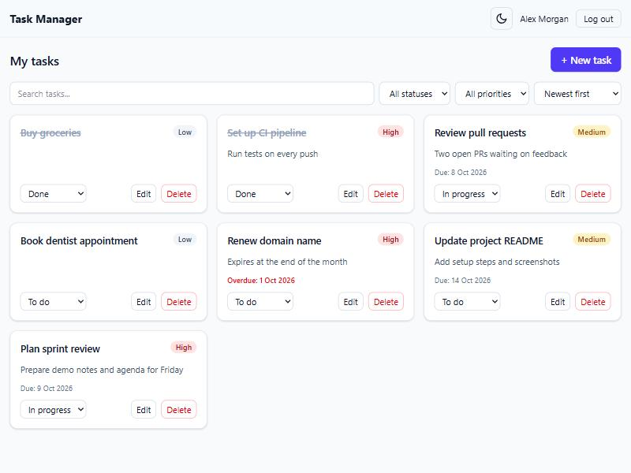
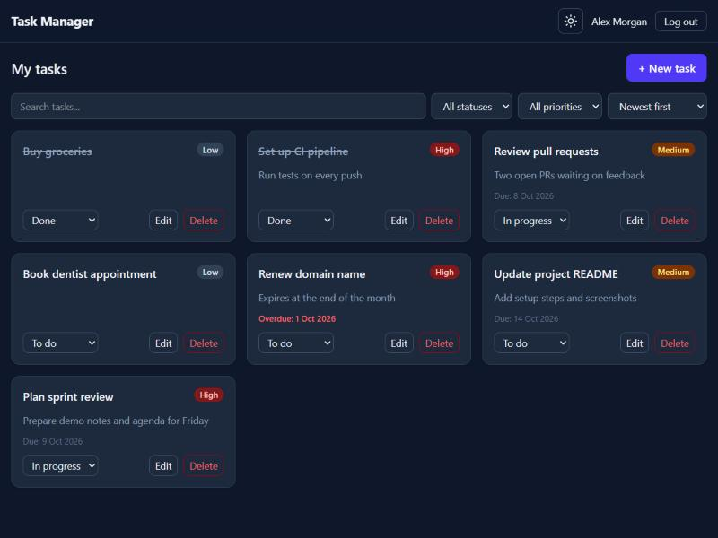
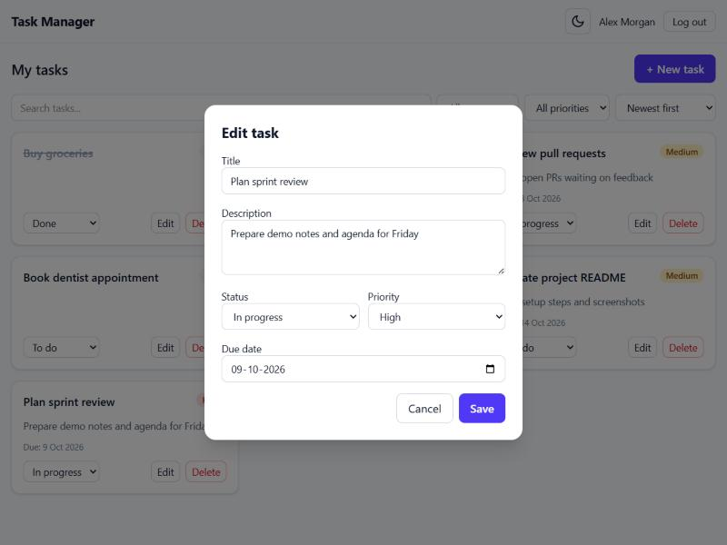
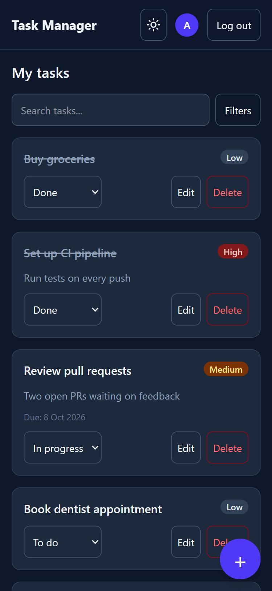

# Task Manager

A full-stack task management app. Users sign up, log in, and manage their own tasks. Each user only ever sees their own data.

**Live app:** https://task-manager-zjur.onrender.com

> The app runs on Render's free tier, which sleeps after about 15 minutes of inactivity. The first request after a quiet period can take around 30 seconds.

## Screenshots

| Light mode | Dark mode |
|:----------:|:---------:|
|  |  |

| Edit task | Mobile |
|:---------:|:------:|
|  |  |

## Features

- **Authentication:** register, log in, log out. Passwords are hashed with bcrypt. Sessions use a JWT stored in an httpOnly cookie.
- **Tasks:** create, edit, delete, and change status. Each task has a title, description, status (To do, In progress, Done), priority (Low, Medium, High), and an optional due date. Overdue tasks are highlighted.
- **User-specific data:** every task query is scoped to the logged-in user. Another user's task returns a 404, and this is covered by tests.
- **Search, filters, and sorting:** debounced search over title and description, filters for status and priority, and five sort orders.
- **Dark mode:** follows your system setting until you choose. The choice is saved, and the page loads without a light flash.
- **Responsive UI:** mobile-first layout, a floating "new task" button and bottom-sheet form on phones, collapsible filters, and touch-friendly tap targets.
- **Optimistic updates:** status changes and deletes appear instantly and roll back if the server rejects them.

## Tech stack

| Layer | Technology |
|-------|------------|
| Frontend | React, Vite, TypeScript, Tailwind CSS, React Router, TanStack Query, Axios |
| Backend | Node.js, Express 5, TypeScript, Zod, Helmet, express-rate-limit |
| Database | PostgreSQL (Neon) with Prisma |
| Auth | JWT in httpOnly cookie, bcryptjs |
| Tests | Vitest, Supertest |
| Hosting | Render (single web service), Neon (database) |

## Architecture

```
Browser
  |
  |  one origin: https://task-manager-zjur.onrender.com
  v
Express server (Render)
  |-- /api/auth/*    register, login, logout, me
  |-- /api/tasks/*   task CRUD, search, filters
  |-- /*             built React app (static files, SPA fallback)
  |
  v
PostgreSQL (Neon) via Prisma
  User 1 --- * Task
```

In production the Express server also serves the built React app. The browser talks to one origin, so the auth cookie is first-party and no cross-site cookie setup is needed. In development the client (port 5173) and API (port 4000) run separately.

## API

All `/api/tasks` routes require a logged-in user.

| Method | Route | Description |
|--------|-------|-------------|
| POST | `/api/auth/register` | Create an account and log in |
| POST | `/api/auth/login` | Log in |
| POST | `/api/auth/logout` | Log out |
| GET | `/api/auth/me` | Current user |
| GET | `/api/tasks` | List your tasks |
| POST | `/api/tasks` | Create a task |
| PATCH | `/api/tasks/:id` | Update a task (partial) |
| DELETE | `/api/tasks/:id` | Delete a task |
| GET | `/api/health` | Health check |

`GET /api/tasks` accepts these query parameters:

| Parameter | Values |
|-----------|--------|
| `search` | Text matched against title and description (case-insensitive) |
| `status` | `todo`, `in_progress`, `done` |
| `priority` | `low`, `medium`, `high` |
| `sort` | `createdAt`, `dueDate`, `priority`, `title` |
| `order` | `asc`, `desc` |

## Project structure

```
client/           React app
  src/components  TaskCard, TaskModal, FilterBar, ThemeToggle, AuthForm, ProtectedRoute
  src/context     AuthContext
  src/hooks       useTasks, useTheme, useDebounce
  src/pages       Login, Register, Dashboard
server/           Express API
  prisma/         schema and migrations
  src/routes      auth.ts, tasks.ts
  src/middleware  auth.ts (JWT check)
render.yaml       Render deployment blueprint
```

## Run it locally

You need Node.js 22 or newer and a PostgreSQL database. A free [Neon](https://neon.tech) database works well.

1. Install dependencies:

   ```bash
   cd server && npm install
   cd ../client && npm install
   ```

2. Create the environment files from the examples:

   ```bash
   cp server/.env.example server/.env
   cp client/.env.example client/.env
   ```

   Then edit `server/.env`:

   | Variable | Description |
   |----------|-------------|
   | `DATABASE_URL` | PostgreSQL connection string |
   | `JWT_SECRET` | A long random string, for example from `openssl rand -hex 32` |
   | `CLIENT_URL` | `http://localhost:5173` |
   | `PORT` | `4000` |

3. Create the database tables:

   ```bash
   cd server && npx prisma migrate dev
   ```

4. Start both servers in two terminals:

   ```bash
   cd server && npm run dev
   ```

   ```bash
   cd client && npm run dev
   ```

5. Open http://localhost:5173.

## Tests

The API tests run against the database in `DATABASE_URL`. They create temporary users and delete them afterwards, so use a development database.

```bash
cd server && npm test
```

They cover registration, login and logout, input validation, task CRUD, search and filters, partial updates, and blocking one user from reading or changing another user's tasks.

## Deployment

The app deploys to Render as one web service defined in `render.yaml`.

1. Push the repository to GitHub.
2. In the Render dashboard, create a **New Blueprint Instance** and select the repository.
3. Enter `DATABASE_URL` when prompted. Render generates `JWT_SECRET` itself.

On each deploy, Render builds the client, generates the Prisma client, applies pending migrations with `prisma migrate deploy`, builds the server, and starts it. Pushes to `main` redeploy automatically.

## Security notes

- Passwords are hashed with bcrypt and never returned by the API.
- The auth cookie is `httpOnly`, and `Secure` in production.
- Request bodies are validated with Zod. Login and register routes are rate limited.
- Helmet sets security headers, including a content security policy.
- Task routes check ownership in the database query, so users cannot reach each other's data.

## License

See [LICENSE](LICENSE).
